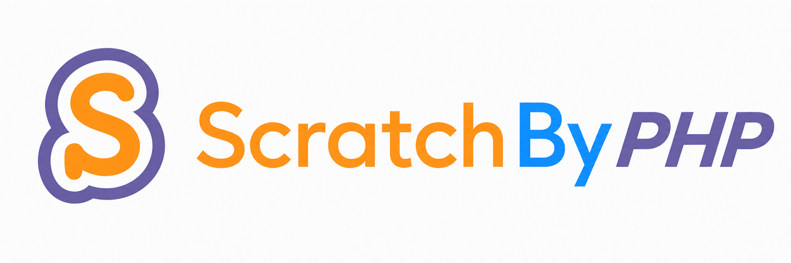

<p align="center">
  <picture>
    <source media="(prefers-color-scheme: dark)" srcset="docs/assets/brand/scratchbyphp-logo-full-dark.png">
    
  </picture>
</p>

<p align="center">
  <strong>PHP ile Scratch arasında güçlü bir köprü.</strong><br>
  Project, User, Studio, authenticated session, Cloud Variables, CloudRequests, CloudDatabase, Analyzer, Watcher, SB3 araçları, CLI ve gömülebilir Wizard Pro tek PHP paketinde.
</p>

<p align="center">
  <a href="https://www.blocklandin.com/scratchbyphp/"></a>
  <a href="https://www.blocklandin.com/scratchbyphp/docs"></a>
  <a href="https://github.com/scratchbyphp/scratchbyphp/actions"></a>
  
  <a href="https://www.php.net/"></a>
  <a href="LICENSE"></a>
  <a href="https://packagist.org/packages/scratchbyphp/scratchbyphp"></a>
</p>

<p align="center">
  <strong>Türkçe</strong> · <a href="README.en.md">English</a> ·
  <a href="https://www.blocklandin.com/scratchbyphp/">Ana Sayfa</a> ·
  <a href="https://www.blocklandin.com/scratchbyphp/docs">Dokümantasyon</a> ·
  <a href="https://github.com/scratchbyphp/scratchbyphp">GitHub</a>
</p>

---

# ScratchByPHP v0.8.5

**Güncel kararlı sürüm: `v0.8.5`**  
**Minimum PHP:** `8.1`  
**Lisans:** MIT

ScratchByPHP, PHP web siteleri, backend servisleri, kontrol panelleri ve CLI/worker süreçleri ile Scratch arasında yeniden kullanılabilir bir SDK/toolkit katmanı oluşturur. Amaç; her projede Scratch endpoint'lerini, cookie/token akışlarını, WebSocket protokolünü, retry/cache mantığını ve model parsing kodlarını baştan yazmak yerine okunabilir PHP API'leri kullanmaktır.

```bash
composer require scratchbyphp/scratchbyphp
```

```php
<?php
require __DIR__ . '/vendor/autoload.php';

use ScratchByPHP\Scratch;

$scratch = new Scratch();
$project = $scratch->project(104);

echo $project->title();
echo $project->views();
```

> ScratchByPHP, Scratch Foundation tarafından geliştirilmiş veya resmî olarak desteklenen bir SDK değildir. Scratch'in resmî olmayan/uygulama içi endpoint'leri zaman içinde değişebilir.

## v0.8.5'te öne çıkanlar

`v0.8.5`, önceki Project/User/Studio/Auth/Cloud çekirdeğini korurken SDK katmanını önemli ölçüde genişletir:

- **CloudDB Pro → MySQL:** CloudDatabase key/value verisini JSON konfigürasyonu veya `mysqli` bağlantısı üzerinden prepared statement ve transaction ile MySQL'e aktarır.
- **Türkçe Trend / Turkish Studio Trending:** adı içinde `türk / Türk / TÜRK` bulunan Scratch stüdyolarını keşfeder, stüdyolardaki projeleri tekilleştirir ve özel trend algoritmasıyla sıralar.
- **ProjectDiff düzeltmesi:** `toArray()` ana çıktı, `summary()` uyumluluk alias'ı olarak çalışır.
- **Wizard Pro:** siteye gömülebilen, taşınabilir ve resize edilebilir ScratchByPHP Control Center; public API, login, Project/User/Studio işlemleri, Cloud, CloudDatabase, CloudRequests, Watcher, Analyzer ve developer araçlarına erişir.
- **Watcher 2.0:** fresh polling, views/loves/favorites/remixes/comment/share değişimleri, persistent state, event queue, jitter/backoff.
- **Reliability/DX:** Cache 2.0, Batch 2.0, Metrics, Retry Policy, Circuit Breaker ve Doctor 2.0.
- **Analyzer/SB3:** Project Analyzer 2.0, ProjectDiff, SB3 Archive ve Validator.
- **Developer tooling:** CLI, FakeScratch, PHPUnit/PHPStan altyapısı, API reference generator ve Bootstrap test merkezi.

## Neden ScratchByPHP?

Ham PHP ile Scratch entegrasyonu yalnızca bir `curl_exec()` çağrısı değildir. Özellikle authenticated ve Cloud tabanlı özelliklerde geliştiricinin şunları yönetmesi gerekir:

- Scratch API endpoint'leri ve cevap yapıları,
- HTTP status/error handling,
- session cookie, CSRF ve X-Token akışı,
- public ve authenticated isteklerin ayrılması,
- Project/User/Studio verilerinin tekrar tekrar parse edilmesi,
- Cloud WebSocket bağlantısı ve packet formatı,
- reconnect/ping/cache/remote verification,
- rate limit, retry ve geçici Scratch hataları,
- test, log redaction ve güvenlik sınırları.

ScratchByPHP bunları merkezi bir katmanda toplar. Sabit bir “%X daha hızlı geliştirme” iddiasında bulunmaz; zaman kazancı projenin kapsamına bağlıdır. Pratik fayda, aynı entegrasyon altyapısını her PHP projesinde tekrar yazmamak ve değişiklikleri tek kütüphane katmanında yönetmektir.

| İş | Ham PHP | ScratchByPHP |
|---|---|---|
| Public Project verisi | cURL + status + JSON parse | `$scratch->project($id)` |
| Auth | cookie + CSRF + X-Token | `$scratch->login()` |
| Project/User/Studio | endpoint başına parse kodu | model nesneleri |
| Pagination | offset/limit döngüsü | Paginator / `allProjects()` |
| Çoklu istek | `curl_multi` altyapısını yaz | Batch / Parallel |
| Cloud Variables | WebSocket protokolü | `$session->cloud()` |
| Cloud RPC | özel protokol | CloudRequests |
| Cloud → MySQL | custom bridge | CloudDB Pro `getToDB()` |
| Canlı değişim | polling/state kodu | Watcher 2.0 |
| Proje analizi | SB3/project.json parsing | Analyzer / ProjectDiff |
| Site-içi yönetim aracı | paneli baştan yaz | Wizard Pro |

---

# Kurulum

## Composer — önerilen

```bash
composer require scratchbyphp/scratchbyphp
```

```php
require __DIR__ . '/vendor/autoload.php';

use ScratchByPHP\Scratch;

$scratch = new Scratch();
```

Composer kullanmayan projeler için repository ZIP'iyle birlikte gelen `autoload.php` da kullanılabilir:

```php
require __DIR__ . '/scratchbyphp/autoload.php';
```

## Gereksinimler

Zorunlu:

- PHP `8.1+`
- `ext-curl`
- `ext-openssl`
- `ext-json`

Özelliğe bağlı:

- `ext-zip`: SB3 ZIP/archive işlemleri için
- `ext-mysqli`: CloudDB Pro → MySQL canlı aktarımı için
- dışarı WebSocket/TLS bağlantısı: Scratch Cloud özellikleri için

---

# Hızlı başlangıç

## Public Project

```php
$project = $scratch->project(104);

echo $project->title();
echo $project->author();
echo $project->views();
echo $project->loves();
echo $project->favorites();
```

Fresh veri:

```php
$data = $project->refresh();
```

Array / JSON:

```php
$array = $project->toArray();
$json  = $project->toJson();
```

## Login / authenticated session

```php
$session = $scratch->login(
    getenv('SCRATCH_USERNAME'),
    getenv('SCRATCH_PASSWORD')
);
```

Session ID ile:

```php
$session = $scratch->loginWithSessionId(
    getenv('SCRATCH_SESSION_ID')
);
```

Authenticated modeller:

```php
$project = $session->project(104);
$user    = $session->user('ExampleUser');
$studio  = $session->studio(123456);
$cloud   = $session->cloud(104);
```

> Password, session ID, X-Token ve CSRF değerlerini repoya commit etmeyin.

---

# Project API

Public okuma ve yardımcılar:

```php
$project = $scratch->project(104);

$project->get();
$project->refresh();
$project->title();
$project->author();
$project->views();
$project->loves();
$project->favorites();
$project->comments();
$project->remixes();
$project->remixInfo();
$project->statsDto();
$project->commentsCollection();
$project->commentsPaginator();
```

Authenticated işlemler:

```php
$project = $session->project(104);

$project->love();
$project->unlove();
$project->favorite();
$project->unfavorite();
$project->postComment('Merhaba Scratch!');
$project->replyComment($commentId, 'Cevap');
$project->share();
$project->unshare();
```

Player yardımcıları:

```php
echo $project->player(800, 600);
echo $project->turbowarpPlayer(900, 650);

echo $project->run([
    'engine' => 'turbowarp',
    'width' => 900,
    'height' => 650,
]);
```

Player helper'ları iframe üretir; görüntülenme sayısını manipüle etmek için tasarlanmaz.

---

# User API

```php
$user = $scratch->user('griffpatch');

$user->get();
$user->bio();
$user->country();
$user->projects();
$user->followers();
$user->following();
$user->favorites();
$user->studios();
$user->activity();
$user->projectsCollection();
$user->projectsPaginator();
$user->profileDto();
```

Authenticated:

```php
$user = $session->user('ExampleUser');
$user->follow();
$user->unfollow();
$user->postComment('Merhaba!');
```

Kendi hesabının desteklenen profil alanları:

```php
$me = $session->user($session->username());
$me->setBio('Yeni bio');
$me->setStatus('Yeni durum');
```

---

# Studio API

```php
$studio = $scratch->studio(123456);

$studio->get();
$studio->projects();
$studio->curators();
$studio->managers();
$studio->comments();
$studio->yourRole();
```

Bütün projeleri pagination ile çekmek:

```php
$projects = $studio->allProjects();
```

Authenticated yönetim:

```php
$studio = $session->studio(123456);

$studio->addProject(104);
$studio->removeProject(104);
$studio->inviteCurator('ExampleUser');
$studio->promoteCurator('ExampleUser');
$studio->removeCurator('ExampleUser');
$studio->setTitle('Yeni stüdyo başlığı');
$studio->setDescription('Yeni açıklama');
$studio->follow();
$studio->unfollow();
```

---

# Search, Explore ve Türkçe Trend

Normal proje/stüdyo araması:

```php
$projects = $scratch->searchProjects('platformer');
$studios  = $scratch->searchStudios('türk');
```

Explore:

```php
$projects = $scratch->exploreProjects('*', 'trending', 'tr');
```

## Turkish Studio Trending

`v0.8.5`te Türkçe Trend artık proje description hashtag'i filtrelemez. Discovery akışı:

1. Scratch Studio Search üzerinde `türk`, `Türk`, `TÜRK` sorguları çalıştırılır.
2. Adında Türk/Türkçe sinyali bulunan stüdyo sonuçları toplanır ve ID bazında tekilleştirilir.
3. Bu stüdyolardaki projeler pagination ile çekilir.
4. Aynı proje birden fazla stüdyoda bulunuyorsa tek proje kaydında birleştirilir.
5. Projeler views, likes/loves, favorites ve paylaşım tarihi/freshness sinyalleriyle ranklanır.

```php
$projects = $scratch->turkishTrending(
    limit: 20,
    scan: 120
);
```

Alias:

```php
$projects = $scratch->turkishTrendProjects(20, 120);
```

Varsayılan rank sinyalleri:

- views: `%35`
- loves: `%15`
- favorites: `%10`
- freshness/shared date: `%40`

Love ve favorite zorunlu eşik değildir; yardımcı sinyaldir. Views/loves/favorites aday kümesinde log-normalize edilir. Sonuçlar `turkish_trend` altında rank/score/signals bilgisi taşır; kaynak stüdyolar da `source_studios` ile izlenebilir.

```php
foreach ($scratch->turkishTrending(20, 120) as $project) {
    echo '#'.$project['turkish_trend']['rank'].' ';
    echo $project['title'].' — ';
    echo $project['turkish_trend']['score'].PHP_EOL;
}
```

---

# Collections, Pagination, Batch ve Cache

## Collection

```php
$collection = $user->projectsCollection();

$top = $collection
    ->filter(fn ($p) => $p->views() > 1000)
    ->sortByDesc(fn ($p) => $p->views())
    ->take(10);
```

## Pagination

```php
$page = $user
    ->projectsPaginator()
    ->limit(20)
    ->page(2)
    ->get();
```

## Batch / Parallel

```php
$results = $scratch->batch()
    ->project(104)
    ->project(105)
    ->user('griffpatch')
    ->concurrency(4)
    ->timeout(15)
    ->retries(2)
    ->onProgress(function ($done, $total, $key, $result) {
        echo "$done / $total — $key\n";
    })
    ->run();
```

## Cache 2.0

```php
$scratch
    ->cache('file')
    ->cacheRules([
        'project:' => 30,
        'user:'    => 120,
        'studio:'  => 60,
    ]);
```

PSR-16 uyumlu cache nesnesi de adapter üzerinden kullanılabilir.

---

# Scratch Cloud Variables

```php
$cloud = $session->cloud(104);
$cloud->connect();

$value = $cloud->getRemote('score');
$result = $cloud->setVerified('score', 500);

$cloud->disconnect();
```

Birden çok değer:

```php
$cloud->connect();

$cloud->setMany([
    'score' => 500,
    'level' => 4,
], true);

$values = $cloud->variables();
$history = $cloud->history('score');

$cloud->waitUntil(
    'score',
    fn ($value) => (int)$value >= 500,
    10
);

$cloud->disconnect();
```

Değişiklik dinleme:

```php
$cloud->connect();

$cloud->onVariable('score', function ($value, $variable) {
    echo $value;
});

$cloud->listen();
```

Uzun süre çalışan listener/RPC işlemlerini normal HTTP request yerine CLI/worker süreçlerinde çalıştırmak daha uygundur.

---

# CloudRequests / RPC

```php
$cloud = $session->cloud(104);
$cloud->connect();

$rpc = $cloud->requests('request', 'response');

$rpc->route('sum', function (array $params) {
    return array_sum($params);
});

$rpc->run();
```

Tek request işleme:

```php
$result = $rpc->handleOnce(5.0);
```

Middleware desteği de bulunur.

---

# CloudDatabase ve CloudDB Pro

Küçük Scratch Cloud key/value katmanı:

```php
$db = $cloud->database('db');

$db->set('level', 12);
$db->increment('coins', 10);
$db->decrement('lives');
$db->has('level');
$db->get('level');
$db->all();
$db->delete('level');
```

CloudDatabase, MySQL/SQLite yerine kullanılacak genel amaçlı bir veritabanı değildir; Scratch Cloud limitlerine bağlı küçük state verileri içindir.

## CloudDB Pro → MySQL

`v0.8.5` ile CloudDatabase map'i MySQL'e aktarılabilir:

```php
$cloud = $session->cloud($projectId);
$cloud->connect();

$result = $cloud
    ->database('db')
    ->getToDB(__DIR__ . '/../secure/mysql.json');

$cloud->disconnect();
```

Alias:

```php
$result = $db->exportToMySQL($config);
```

Örnek JSON config:

```json
{
  "host": "localhost",
  "port": 3306,
  "username": "scratch_user",
  "password": "CHANGE_ME",
  "database": "scratch_app",
  "table": "scratch_cloud",
  "mode": "kv",
  "key_column": "cloud_key",
  "value_column": "cloud_value",
  "updated_at_column": "updated_at",
  "upsert": true,
  "auto_create": false,
  "charset": "utf8mb4"
}
```

Güvenlik/DB davranışı:

- `mysqli` kullanır,
- prepared statement ile key/value yazar,
- transaction + rollback kullanır,
- tablo/kolon adlarını identifier whitelist ile doğrular,
- isteğe bağlı `ON DUPLICATE KEY UPDATE`,
- isteğe bağlı tablo oluşturma,
- nested array/object değerlerini JSON string olarak saklar.

DB'ye bağlanmadan transfer planı:

```php
use ScratchByPHP\Cloud\CloudDatabase;

$plan = CloudDatabase::planToDB(
    ['level' => 12, 'coins' => 500],
    [
        'table' => 'scratch_cloud',
        'key_column' => 'cloud_key',
        'value_column' => 'cloud_value',
    ]
);
```

MySQL config dosyasını `public_html` dışında tutun; repoya commit etmeyin.

---

# Watcher 2.0

Watcher REST polling tabanlıdır; webhook değildir.

```php
$watch = $scratch
    ->watch()
    ->interval(10)
    ->project(104);

$baseline = $watch->baseline();
```

Eventler:

```php
$watch->onView(fn ($new, $old) => print "$old -> $new");
$watch->onLove(fn ($new, $old) => null);
$watch->onFavorite(fn ($new, $old) => null);
$watch->onRemix(fn ($new, $old) => null);
$watch->onComment(fn ($comment) => null);
$watch->onChange(fn ($field, $new, $old) => null);
```

Watcher live tick'lerde `Project::refresh()` kullanır; normal proje cache'inin değişiklikleri gizlemesini önler. Yorum değişikliği proje stats'ında olmayan bir `comments` alanına dayanmaz; son yorum ID'si üzerinden takip edilir.

Persistent state/event queue/jitter/backoff özellikleri Worker tarzı süreçler için kullanılabilir.

---

# Project Analyzer, ProjectDiff ve SB3

```php
$analysis = $scratch->project(104)->analyze();

print_r($analysis->summary());
print_r($analysis->warnings());
print_r($analysis->opcodeCounts());
```

Analyzer; sprite, block, costume, sound, variable, extension, duplicate script, unused variable, broadcast graph ve complexity gibi proje yapısı sinyallerini incelemek için kullanılır.

İki proje:

```php
$diff = $scratch->compareProjects(104, 105);

print_r($diff->toArray());
print_r($diff->summary()); // compatibility alias
```

SB3:

```php
$project->downloadSb3(__DIR__.'/project.sb3');
$sb3 = $project->sb3();
```

Validator:

```php
$validator = new ScratchByPHP\Sb3\Sb3Validator();
$result = $validator->validate(__DIR__.'/project.sb3');
```

---

# Wizard Pro — siteye gömülebilir ScratchByPHP Control Center

Wizard Pro, kullanıcıların ScratchByPHP özelliklerini kendi sitelerinde ayrı yönetim paneli yazmadan kullanabilmesi için tasarlanmıştır.

```php
<?php
require __DIR__.'/vendor/autoload.php';

use ScratchByPHP\Scratch;

$scratch = new Scratch();

$wizard = $scratch->wizard([
    'allow_auth' => true,
    'allow_writes' => true,

    // Browser yalnızca profil adını görür; DB credential'ları server-side kalır.
    'clouddb_profiles' => [
        'main' => __DIR__.'/../secure/mysql.json',
    ],

    'cloud_request_handlers' => [
        'sum' => fn (array $params) => array_sum($params),
    ],
]);

// HTML çıktısından ÖNCE:
$wizard->handle();
?>

<?= $wizard->render([
    'title' => 'ScratchByPHP Control Center',
    'width' => 980,
    'height' => 680,
]) ?>
```

Wizard özellikleri:

- draggable,
- resize edilebilir,
- tam ekran/maximize,
- ScratchByPHP marka asset'i ve mor/turuncu/beyaz tema,
- özellik arama,
- JSON sonuç paneli,
- aynı işlemin PHP snippet'ini üretme,
- public Project/User/Studio/Search,
- server-side Scratch login/logout,
- authenticated Project/User/Studio aksiyonları,
- Cloud Variables / CloudDatabase / CloudRequests,
- CloudDB Pro server-side MySQL profile,
- Watcher baseline/tick,
- Analyzer/ProjectDiff,
- Health/Metrics/Circuit Breaker.

Wizard güvenlik modeli:

- Scratch parolası kalıcı saklanmaz,
- Scratch session ID browser response'una gönderilmez,
- PHP `$_SESSION` içinde server-side tutulur,
- Wizard API CSRF token ile korunur,
- token/session/password/cookie/project_token benzeri alanlar redacted edilir,
- destructive işlemler kullanıcı onayı ister,
- authenticated kullanımda HTTPS önerilir.

---

# Reliability / Developer Experience

## Retry Policy

```php
$scratch->retry()
    ->maxAttempts(4)
    ->backoff('exponential')
    ->baseDelayMs(200)
    ->retryOn([429, 500, 502, 503]);
```

## Circuit Breaker

```php
$scratch->circuitBreaker()
    ->threshold(5)
    ->cooldown(30);
```

## Metrics

```php
print_r($scratch->metrics()->summary());
```

## Doctor / Health

```php
print_r($scratch->healthCheck(true));
```

Kontroller arasında PHP sürümü, cURL/OpenSSL/JSON/ZIP, temp dir, DNS, Scratch API ve latency gibi sinyaller bulunur.

## Debug

```php
$scratch->debug()->enable();
```

Hassas session/token alanlarının loglarda açığa çıkmaması için redaction katmanı bulunur.

---

# CLI

```bash
php bin/scratchbyphp version
php bin/scratchbyphp doctor --json
php bin/scratchbyphp project 104 --json
php bin/scratchbyphp user griffpatch --json
php bin/scratchbyphp studio 123456 --json
php bin/scratchbyphp analyze 104 --json
php bin/scratchbyphp check-api --json
php bin/scratchbyphp sb3:validate project.sb3 --json
php bin/scratchbyphp metrics --json
```

---

# Fake / testing

```php
$fake = Scratch::fake()
    ->fakeProject(104, [
        'title' => 'Test project',
        'stats' => ['views' => 500],
    ]);

$project = $fake->project(104);
```

Repo ayrıca:

- `tests/`
- `test-panels/`
- `phpunit.xml`
- `phpstan.neon`
- `tools/generate-api.php`

içerir.

Tarayıcı test merkezi:

```text
/test-panels/index.php
```

`v0.8.5` test merkezi Core/DX, Public API, Cloud, Analyzer/SB3, CLI/Doctor, Integration, Watcher, Authentication, Reliability, Wizard, CloudDB Pro ve Turkish Trending kontrollerini içerir.

---

# Registration Assistant

```php
$registration = $scratch->registration();
$result = $registration->generateAvailableCredentials('ScratchUser');

echo $registration->joinUrl();
```

Registration Assistant CAPTCHA çözmez veya atlamaz. Kayıt Scratch'in resmî sayfasında kullanıcı tarafından tamamlanır.

Credential JSON formatında parola plaintext bulunabilir. Bu dosyaları credential dosyası gibi koruyun ve repoya commit etmeyin.

---

# Güvenlik

ScratchByPHP'nin güvenlik sertleştirmeleri arasında:

- credential taşıyan authenticated HTTP isteklerini Scratch HTTPS hostlarıyla sınırlama,
- auth taşıyan cross-host redirect riskini azaltma,
- logger/debug redaction,
- session ID kontrol karakteri ve uzunluk doğrulaması,
- compressed session payload decode sınırı,
- dosya yazma/download yardımcılarında path kontrolleri,
- Wizard server-side session ve CSRF modeli,
- CloudDB Pro prepared statement + identifier validation

bulunur.

Uygulama tarafında yine şu kurallara uyun:

- `.env`, password, session ID, token ve MySQL credential'larını commit etmeyin,
- credential JSON/MySQL config dosyalarını public web klasöründe tutmayın,
- kullanıcıdan gelen filesystem path'lerini doğrudan helper'lara vermeyin,
- authenticated aksiyonları yalnızca işlem yapmaya yetkili olduğunuz hesaplarla kullanın,
- CAPTCHA/anti-abuse mekanizmalarını atlatmak, spam veya yapay etkileşim üretmek için kullanmayın.

Detay: [SECURITY.md](SECURITY.md)

---

# Proje yapısı

```text
ScratchByPHP/
├── .github/                 # Actions, issue/PR şablonları
├── docs/                    # web docs + llms.txt + brand asset'leri
├── examples/                # kullanım örnekleri
├── src/
│   ├── Analysis/
│   ├── Auth/
│   ├── Batch/
│   ├── Cache/
│   ├── Cli/
│   ├── Cloud/
│   ├── Collections/
│   ├── Comment/
│   ├── DTO/
│   ├── Debug/
│   ├── Http/
│   ├── Interop/
│   ├── Observability/
│   ├── Pagination/
│   ├── Project/
│   ├── Sb3/
│   ├── Studio/
│   ├── Testing/
│   ├── Trending/
│   ├── Ui/
│   ├── User/
│   └── Watch/
├── test-panels/
├── tests/
├── tools/
├── README.md
├── README.en.md
├── SECURITY.md
├── CHANGELOG.md
├── LICENSE
└── composer.json
```

---

# Test ve geliştirme

```bash
composer install
composer validate --strict
composer lint
composer test
composer analyse
composer security
php tests/smoke.php
php tests/security.php
php tests/v085.php
php tests/v085_wizard.php
php tests/project_diff.php
php tests/turkish_studio_discovery.php
```

---

# Resmî bağlantılar

- **Ana Sayfa:** https://www.blocklandin.com/scratchbyphp/
- **Dokümantasyon:** https://www.blocklandin.com/scratchbyphp/docs
- **GitHub:** https://github.com/scratchbyphp/scratchbyphp
- **Packagist:** https://packagist.org/packages/scratchbyphp/scratchbyphp
- **AI / LLM referansı:** [`docs/llms.txt`](docs/llms.txt)
- **Examples:** [`examples/`](examples/)

Ana dokümantasyon dili Türkçedir; İngilizce README de birlikte tutulur.

---

# Teşekkür ve kaynaklar

ScratchByPHP'nin API tasarımı ve özellik kapsamı geliştirilirken TimMcCool tarafından geliştirilen [scratchattach](https://github.com/TimMcCool/scratchattach) önemli bir referans ve ilham kaynağı olmuştur.

ScratchByPHP bağımsız bir PHP uygulamasıdır; scratchattach'ın resmî PHP portu değildir. Ayrıntılar için [THIRD_PARTY_NOTICES.md](THIRD_PARTY_NOTICES.md).

# Katkı

Issue ve pull request'ler açıktır. Katkıdan önce [CONTRIBUTING.md](CONTRIBUTING.md) dosyasını inceleyin.

Hata bildirirken mümkünse:

- ScratchByPHP sürümü,
- PHP sürümü,
- minimal örnek kod,
- exception / HTTP sonucu

paylaşın; **credential paylaşmayın**.

# Lisans

[MIT License](LICENSE)

ScratchByPHP, Scratch Foundation ile bağlantılı değildir. “Scratch” ve ilgili markalar ilgili sahiplerine aittir.
