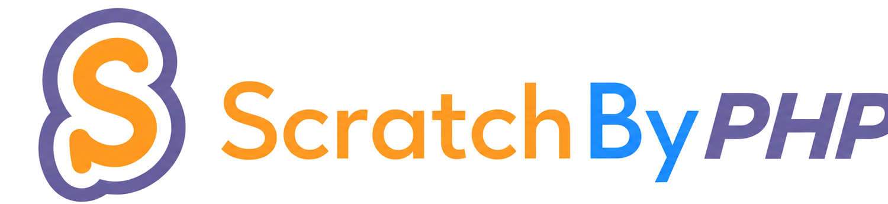

<p align="center"></p>

# ScratchByPHP

> **PHP ile Scratch arasında köprü.** Scratch projelerini, kullanıcılarını, stüdyolarını ve Cloud Variables altyapısını PHP uygulamalarından kullanmayı kolaylaştıran açık kaynak kütüphane.

[](https://github.com/scratchbyphp/scratchbyphp/actions/workflows/ci.yml)
[](https://www.php.net/)
[](LICENSE)
[](https://packagist.org/)

**Türkçe** · [English README](README.en.md) · [Dokümantasyon](docs/index.html)

---

## ScratchByPHP nedir?

Scratch ile PHP dünyası arasında doğrudan çalışmayı kolaylaştıran bir araçtır.

Bir web siteniz, yönetim paneliniz, Discord/web servisi entegrasyonunuz veya PHP tabanlı başka bir uygulamanız varsa Scratch verilerini kullanmak için her endpoint'i, cookie'yi, token'ı ve Cloud WebSocket protokolünü sıfırdan yazmak yerine ScratchByPHP üzerinden daha okunabilir bir API kullanabilirsiniz.

```php
$scratch = new ScratchByPHP\Scratch();

$project = $scratch->project(104);

echo $project->title();
echo $project->views();
```

ScratchByPHP'nin hedefi yalnızca bir “API wrapper” olmak değildir. Projenin fikri şudur:

> **Web sitelerini ve PHP uygulamalarını Scratch'e bağlayan köprü olmak.**

PHP web tarafında çok yaygın kullanılan bir teknolojidir. ScratchByPHP, Scratch'i klasik web siteleri, kontrol panelleri, PHP backend'leri ve Cloud Variable tabanlı uygulamalarla daha kolay bir araya getirmeyi amaçlar.

### Neler yapılabilir?

- Kullanıcı bilgilerini ve projelerini okuyabilirsiniz.
- Proje istatistiklerini, yorumlarını ve remixlerini kullanabilirsiniz.
- Yetkili oturumla proje ve stüdyo işlemleri gerçekleştirebilirsiniz.
- Stüdyo proje/curator yönetimi yapabilirsiniz.
- Scratch Cloud Variables ile PHP arasında veri alışverişi kurabilirsiniz.
- Cloud event'lerini dinleyebilirsiniz.
- CloudRequests ile Scratch projesinden PHP backend'e basit RPC istekleri gönderebilirsiniz.
- Scratch proje JSON'unu analiz edebilirsiniz.
- Scratch veya TurboWarp player için iframe üretebilirsiniz.
- Registration Assistant ile tek hesaplık kayıt yardımcısı ve JSON credential profili oluşturabilirsiniz.

> ScratchByPHP, Scratch Foundation tarafından geliştirilmiş veya resmî olarak desteklenen bir SDK değildir. Scratch endpoint'leri zaman içinde değişebilir.

---

## 1. Kurulum

### Composer ile — önerilen yöntem

Bilgisayarınızda Composer varsa:

```bash
composer require scratchbyphp/scratchbyphp
```

Ardından:

```php
<?php

require __DIR__ . '/vendor/autoload.php';

use ScratchByPHP\Scratch;

$scratch = new Scratch();
```

### Composer bilmiyorum, ne yapacağım?

Composer PHP'nin paket yöneticisidir. Node.js'teki `npm` gibi düşünebilirsiniz.

1. Composer'ı kurun.
2. Terminali projenizin klasöründe açın.
3. Şunu çalıştırın:

```bash
composer require scratchbyphp/scratchbyphp
```

4. PHP dosyanızın başına şunu ekleyin:

```php
require __DIR__ . '/vendor/autoload.php';
```

Bu kadar.

### Composer kullanmadan

Repo ZIP'ini indirip klasör olarak projenize koyarsanız kütüphanenin kendi autoload dosyasını da kullanabilirsiniz:

```php
require __DIR__ . '/scratchbyphp/autoload.php';
```

---

## 2. İlk program — giriş gerektirmez

```php
<?php

require __DIR__ . '/vendor/autoload.php';

use ScratchByPHP\Scratch;

$scratch = new Scratch();

$project = $scratch->project(104);

echo 'Proje: ' . $project->title() . '<br>';
echo 'Görüntülenme: ' . $project->views() . '<br>';
echo 'Beğeni: ' . $project->loves() . '<br>';
echo 'Favori: ' . $project->favorites();
```

Burada Scratch hesabına giriş yapmıyoruz. Çünkü public proje bilgisini okumak için oturum gerekmiyor.

---

## 3. Scratch hesabına giriş

```php
$scratch = new Scratch();

$session = $scratch->login(
    'KullaniciAdi',
    'Sifre'
);

echo $session->username();
```

Başarılı girişten sonra `$session`, hesabınıza bağlı işlemlerin merkezidir.

```php
$user = $session->user('griffpatch');
$project = $session->project(104);
$studio = $session->studio(123456);
$cloud = $session->cloud(104);
```

### Session ID ile

```php
$session = $scratch->loginWithSessionId(
    getenv('SCRATCH_SESSION_ID')
);
```

**Önemli:** parola, session ID ve X-Token değerlerini GitHub'a koymayın.

---

## 4. Kullanıcı API'si

```php
$user = $scratch->user('griffpatch');

$data = $user->get();

echo $user->username();
echo $user->bio();
echo $user->country();

$projects = $user->projects();
$followers = $user->followers();
$following = $user->following();
$favorites = $user->favorites();
```

Oturum gerektiren örnek:

```php
$user = $session->user('BirKullanici');

$user->follow();
$user->unfollow();
```

Profil sahibi olduğunuz hesap üzerinde:

```php
$me = $session->user($session->username());

$me->setBio('Yeni bio');
$me->setStatus('Yeni durum');
```

---

## 5. Project API

```php
$project = $scratch->project(104);

echo $project->id();
echo $project->title();
echo $project->author();
echo $project->views();
echo $project->loves();
echo $project->favorites();

$comments = $project->comments();
$remixes = $project->remixes();
$remixInfo = $project->remixInfo();
```

Yetkili işlemler:

```php
$project = $session->project(104);

$project->love();
$project->favorite();

$project->unlove();
$project->unfavorite();

$project->postComment('Merhaba Scratch!');
```

Share işlemleri:

```php
$project->share();
$project->unshare();
```

### Projeyi görüntüleme / player

```php
$project = $scratch->project(104);

echo $project->url();
echo $project->embedUrl();

echo $project->player(800, 600);
```

TurboWarp:

```php
echo $project->run([
    'engine' => 'turbowarp',
    'width' => 900,
    'height' => 650
]);
```

Player metodu bir iframe üretir; Scratch görüntülenme sayısını artırmayı amaçlayan özel bir fonksiyon değildir.

---

## 6. Project Analyzer

```php
$project = $scratch->project(104);

$analysis = $project->analyze();

print_r($analysis->summary());
```

Bu özellik proje JSON'unu inceleyerek sprite, block, costume, sound, variable, Cloud Variable ve extension gibi bilgileri analiz etmek için kullanılabilir.

---

## 7. Studio API

```php
$studio = $scratch->studio(123456);

echo $studio->title();

$projects = $studio->projects();
$curators = $studio->curators();
$managers = $studio->managers();
```

Yetkili stüdyo işlemleri:

```php
$studio = $session->studio(123456);

$studio->addProject(104);
$studio->removeProject(104);

$studio->inviteCurator('Kullanici');
$studio->promoteCurator('Kullanici');
$studio->removeCurator('Kullanici');

$studio->setTitle('Yeni isim');
$studio->setDescription('Yeni açıklama');
```

---

## 8. Scratch Cloud Variables

Scratch projesindeki Cloud Variable ile PHP arasında veri aktarımı:

```php
$cloud = $session->cloud(104);

$cloud->connect();

$value = $cloud->getRemote('score');

echo $value;

$cloud->disconnect();
```

Değer yazma ve doğrulama:

```php
$cloud->connect();

$result = $cloud->setVerified('score', 500);

print_r($result);

$cloud->disconnect();
```

`setVerified()` yalnızca local cache'i değiştirmek yerine Scratch tarafındaki değişikliği doğrulamaya çalışır.

### Değişiklik dinleme

```php
$cloud->connect();

$cloud->onVariable('score', function ($value, $variable) {
    echo 'Yeni skor: ' . $value . PHP_EOL;
});

$cloud->listen();
```

Uzun süre çalışan `listen()` işlemlerini normal web request'i yerine CLI/worker süreçlerinde kullanmanız önerilir.

---

## 9. CloudRequests — Scratch → PHP RPC

Scratch projenizin PHP backend'e istek göndermesine uygun basit bir katman:

```php
$cloud = $session->cloud(104);
$cloud->connect();

$rpc = $cloud->requests('request', 'response');

$rpc->on('sum', function (array $params) {
    return array_sum($params);
});

$rpc->run();
```

Bu özellik Scratch projesi ile web backend'iniz arasında özel protokoller geliştirmeniz için temel sağlar.

---

## 10. CloudDatabase

Küçük verileri Cloud Variable üzerinde saklamak için:

```php
$cloud = $session->cloud(104);
$cloud->connect();

$db = $cloud->database('db');

$db->set('level', 12);

echo $db->get('level');

$db->delete('level');

$cloud->disconnect();
```

Bu gerçek bir MySQL/SQLite veritabanının yerini tutmaz. Scratch Cloud Variable limitleri nedeniyle küçük durum verileri içindir.

---

## 11. Arama, Explore ve mesajlar

```php
$projects = $scratch->searchProjects('platformer');
$trending = $scratch->exploreProjects('*', 'trending');
```

Oturum üzerinden:

```php
$messages = $session->messages();
$adminMessages = $session->adminMessages();

$studios = $session->searchStudios('game');
$news = $session->news();
```

---

## 12. Registration Assistant

ScratchByPHP CAPTCHA'yı otomatik çözmez veya atlamaz.

```php
$registration = $scratch->registration();

$result = $registration->generateAvailableCredentials(
    'ScratchUser'
);

print_r($result);
```

Kullanıcı resmi Scratch kayıt sayfasında CAPTCHA'yı kendisi tamamlar:

```php
echo $registration->joinUrl();
```

Credential JSON:

```php
$json = $registration->credentialsJson(
    'ScratchUser_ABC123',
    'MyStrongPassword123!',
    'mail@example.com'
);
```

JSON'u geri okumak:

```php
$credentials = $registration->parseCredentialsJson(
    file_get_contents('scratch-account.json')
);
```

Credential JSON düz metin parola içerebilir; gizli tutulmalıdır.

---

## 13. Retry, proxy ve debug

```php
$session->setRetries(3, 250);

$session->setProxy(
    'http://127.0.0.1:8080'
);

$session->enableLogger(
    __DIR__ . '/scratchbyphp.log'
);
```

Auth teşhisi:

```php
print_r(
    $session->authDiagnostics(104)
);
```

Token değerlerini ekrana veya loglara yazmamaya dikkat edin.

---

## 14. Hata yakalama

```php
use ScratchByPHP\Exceptions\ApiException;
use ScratchByPHP\Exceptions\LoginException;

try {
    $session = $scratch->login($username, $password);
} catch (LoginException $e) {
    echo 'Giriş başarısız: ' . $e->getMessage();
} catch (ApiException $e) {
    echo 'Scratch API hatası: ' . $e->getMessage();
}
```

---

## Gereksinimler

- PHP 8.1+
- cURL extension
- OpenSSL extension
- JSON extension
- Cloud bağlantıları için dışarı WebSocket/TLS erişimi olan bir sunucu

---

## Packagist'e yayınlama

Repo GitHub'a yüklendikten sonra:

1. GitHub repository oluşturun.
2. Bu klasörün içeriğini repo köküne yükleyin.
3. `v0.5.1` tag'i oluşturun.
4. Packagist'te **Submit** ile GitHub repo URL'sini ekleyin.
5. Bundan sonra kullanıcılar:

```bash
composer require scratchbyphp/scratchbyphp
```

ile kurabilir.

Yeni sürüm yayınlarken semantic versioning kullanmanız önerilir:

```text
0.5.1  yeni özellikler
0.5.1  hata düzeltmeleri
0.6.0  yeni özellikler
1.0.0  kararlı public API
```

---

## Projenin vizyonu

Scratch'ın güçlü topluluğu ve yaratıcı proje modeli var. PHP tarafında ise web siteleri, paneller, backend servisleri ve geleneksel hosting altyapıları çok yaygın.

ScratchByPHP bu iki dünyayı birbirine yaklaştırmayı hedefler:

```text
Scratch Project
      ↕
Cloud Variables / Scratch API
      ↕
ScratchByPHP
      ↕
PHP Website / Backend / Panel / Application
```

Amaç, bir PHP geliştiricisinin Scratch'e bağlanmak için protokol ayrıntılarıyla saatlerce uğraşmak yerine birkaç okunabilir metodla işe başlayabilmesidir.

---

## Güvenlik ve sorumlu kullanım

### v0.5.1 güvenlik korumaları

- Authenticated HTTP istemcisi credential taşıyan istekleri yalnızca HTTPS Scratch domainlerine gönderir.
- Credential taşıyan HTTP isteklerinde otomatik redirect kapalıdır.
- Logger token/session/cookie gibi gizli değerleri `[REDACTED]` olarak yazar.
- Session ID boyutu ve kontrol karakterleri doğrulanır; decode edilen sıkıştırılmış payload 64 KiB ile sınırlandırılır.
- Dosya indirme metoduna web kullanıcısından gelen path'i doğrudan vermeyin. Hedef yolu uygulamanızın kendisi belirlesin.
- Account JSON'un plaintext parola içermesi bilinçli tasarımdır; bu dosyayı `.env` veya parola dosyası gibi gizli tutun ve public web dizinine koymayın.


ScratchByPHP güçlü oturum ve yazma fonksiyonları içerir. Kendi hesabınız veya işlem yapmaya yetkili olduğunuz hesaplarla kullanın.

- CAPTCHA veya anti-abuse kontrollerini atlatmayın.
- Kullanıcı parolalarını loglamayın.
- Session ID/X-Token bilgilerini paylaşmayın.
- Scratch topluluk kurallarına ve kullanım şartlarına uyun.
- Toplu spam, yapay etkileşim veya kötüye kullanım için kullanmayın.

---

## Katkı

Katkı yapmak isterseniz [CONTRIBUTING.md](CONTRIBUTING.md) dosyasına bakın.

Bug report veya feature request için GitHub Issues kullanılabilir.

---


## Teşekkür ve kaynaklar

ScratchByPHP'nin API tasarımı ve özellik kapsamı geliştirilirken
[TimMcCool/scratchattach](https://github.com/TimMcCool/scratchattach) önemli bir
**referans ve ilham kaynağı** olmuştur. `scratchattach`, Python tarafında geniş bir
Scratch API/Cloud araç setidir ve MIT lisansı ile yayımlanmaktadır.

ScratchByPHP bağımsız bir PHP uygulamasıdır; scratchattach'ın resmî PHP portu değildir.
Daha ayrıntılı bilgi için [THIRD_PARTY_NOTICES.md](THIRD_PARTY_NOTICES.md) dosyasına bakın.

## Lisans

MIT. Ayrıntı için [LICENSE](LICENSE).

---

ScratchByPHP, Scratch Foundation ile bağlantılı değildir. “Scratch” ve ilgili markalar ilgili sahiplerine aittir.
